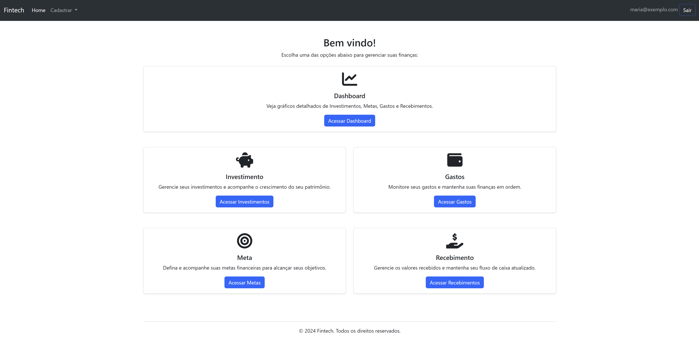

# Fintech

Fintech is an academic project developed as part of the coursework for **FIAP**. The project aims to assist users in managing their personal finances effectively. By offering features such as dashboards, investment tracking, spending analysis, goal setting, and income management, the application provides a comprehensive solution for personal financial planning.

## Features

- **Dashboard**: Visualize financial data and trends through interactive charts and graphs.
- **Investments**: Track and manage your investment portfolio.
- **Expenses**: Record and analyze personal expenses.
- **Goals**: Set financial goals and monitor progress.
- **Income**: Manage and track all income sources.

## Technologies Used

- **Programming Language**: Java
- **Web Technologies**: JSP, Servlet
- **Database**: Oracle Database
- **Frontend**: HTML, CSS, Bootstrap
- **Development Tools**: IntelliJ IDEA, Apache Tomcat Server

## Installation and Setup

To set up and run the project locally, follow these steps:

### Prerequisites

- Install [Java JDK 11+](https://www.oracle.com/java/technologies/javase-jdk11-downloads.html).
- Install [Oracle Database](https://www.oracle.com/database/technologies/oracle-database-software-downloads.html).
- Install [Apache Tomcat](https://tomcat.apache.org/).
- Install a Java IDE (e.g., Eclipse or IntelliJ IDEA).

### Steps

1. Clone the repository:
   ```bash
   git clone https://github.com/Diogobitten/fintech-java-app.git
   cd fintech-java-app
   ```

2. Import the project into your Java IDE.

3. Configure the Oracle Database:
   - Create the necessary tables using the provided SQL scripts (`/database/fintech_schema.sql`).
   - Update database credentials in the `OracleXxxDao.java` files located in the `dao` package.

4. Deploy the project on Apache Tomcat:
   - Export the project as a WAR file or configure it directly in your IDE with Tomcat.

5. Access the application in your browser:
   ```bash
   http://localhost:8080/fintech
   ```

## Project Structure

- **Model Layer**: Contains Java classes representing the core business logic and data models (e.g., `Investimento`, `Gastos`, `Recebimento`).
- **DAO Layer**: Manages database operations for each module (e.g., `InvestimentoDao`, `GastosDao`).
- **Servlets**: Handles HTTP requests and integrates the frontend with backend logic.
- **Views**: JSP files for user interaction (e.g., `lista-inv.jsp`, `dashboard.jsp`).
- **Static Resources**: Includes CSS, JavaScript, and Bootstrap files for styling and interactivity.

## Usage

1. **Dashboard**:
   - View overall financial summaries and visualized data.
2. **Investments**:
   - Add, edit, or delete investment records.
3. **Expenses**:
   - Log daily expenses and generate spending reports.
4. **Goals**:
   - Define goals (e.g., saving for a car) and track progress.
5. **Income**:
   - Input and manage various sources of income.

## Screenshots



## Academic Context

This project was developed for the **Fintech Project – 2nd Semester 2024** at **FIAP**. Its purpose is to demonstrate proficiency in building Java-based web applications with Oracle database integration.

## Contributors

- **Diogo Bittencourt and Nathan** – Frontend and Backend Development
